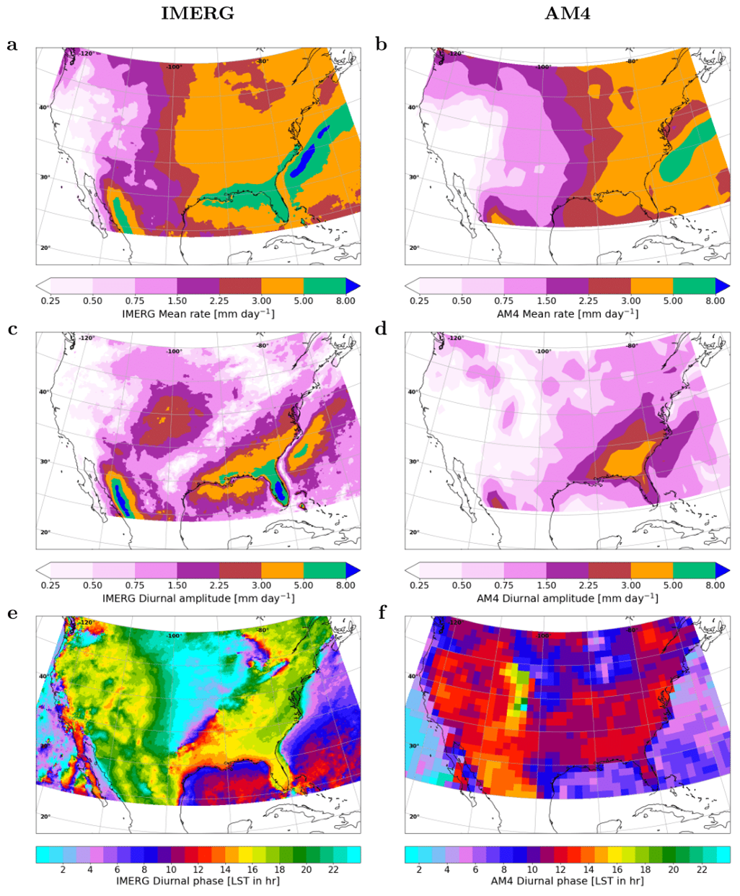
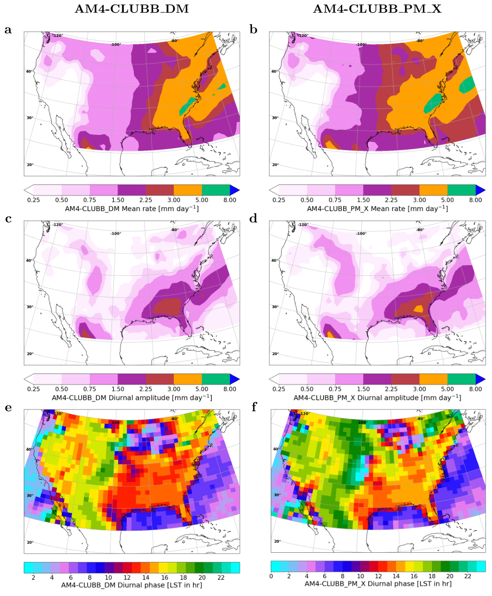
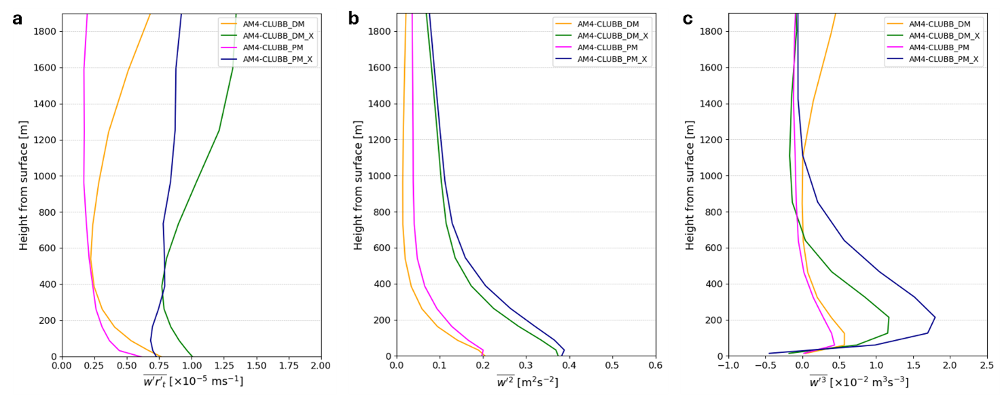

The Great Plains of the United States represent one of the most complex natural laboratories for studying convective meteorology and its interaction with strong wind currents flowing from south to north. In summer, this vast region is characterized by a nocturnal maximum of precipitation, linked to the formation of low-level jets (LLJ): intense currents that develop within the first kilometers of the atmosphere and transport large amounts of moisture from the Gulf of Mexico northward. This transport favors the initiation of thunderstorms even in the absence of strong synoptic forcing, making nocturnal convective events a key element of the regional climate.

Despite their importance, faithfully reproducing the nocturnal rainfall peak and the structure of LLJs remains a challenge for numerical models, which often tend to generate an erroneous daytime maximum. This is related to convective parameterizations that are overly sensitive to surface thermal instability produced by daytime heating over the Great Plains. Observational campaigns such as PECAN have highlighted these limitations, pointing to the critical role of turbulent processes in the boundary layer for triggering nocturnal convection.

To address these limitations, we extended the CLUBB turbulence scheme in the GFDL-AM4 global climate model by introducing two innovations: a **prognostic treatment of momentum fluxes** and a **multiscale turbulent lengthscale**. This configuration was tested to assess its impact on nocturnal summer precipitation and LLJ structure in the Great Plains, comparing results with satellite and radar observations.

---

## Methods

We performed five simulations:

- Control with standard AM4.  
- AM4-CLUBB_DM (diagnostic momentum flux).  
- AM4-CLUBB_PM (prognostic momentum flux).  
- AM4-CLUBB_DM_X (diagnostic momentum flux with multiscale turbulent lengthscale).  
- AM4-CLUBB_PM_X (prognostic momentum flux with multiscale turbulent lengthscale).  

Evaluation relied on satellite precipitation data (IMERG, NASA) and vertical wind profiles from the ARM Southern Great Plains site (Oklahoma).

---

## Results

The reference AM4 simulations show the well-known bias: the diurnal cycle of summer precipitation peaks in the afternoon instead of at night, about 6–8 hours too early, and with attenuated amplitude. This deficit is tied to poor representation of the LLJ and nighttime moisture transport.

Introducing CLUBB yields improvements. With diagnostic momentum flux (AM4-CLUBB_DM), the precipitation peak shifts closer to evening. With prognostic flux (AM4-CLUBB_PM), the peak aligns near 03 UTC, close to observed 01–02 UTC, and the amplitude improves by 40%.

Adding the multiscale turbulent lengthscale further improves the match with observations, reducing precipitation bias to less than –1 mm/day compared to –3 mm/day in control runs.

Vertical profiles reveal that single-lengthscale runs confine turbulence to the lowest 200 m, while multiscale formulations sustain fluxes and variances above 2000 m, enhancing nocturnal convection.

As for LLJ structure, prognostic flux strengthens the jet by ~2 m/s relative to diagnostic, while the multiscale formulation tends to weaken it. Comparisons with ARM data suggest prognostic-only configurations overshoot jet core height, while the multiscale+prognostic formulation reduces shear and restores a more realistic jet depth.

---

## Conclusions

This study demonstrates that a more realistic representation of subgrid scalar and momentum turbulent transport can yield substantial improvements in simulating key regional processes. The combined use of prognostic momentum flux and multiscale turbulent lengthscale in CLUBB significantly reduced the nocturnal precipitation phase bias over the Great Plains while also improving LLJ intensity and Gulf moisture transport.

Importantly, these advances were achieved without ad hoc parameter tuning, but solely by introducing turbulence physics more faithful to the underlying Navier–Stokes equations. This reinforces the idea that the evolution of climate models does not only rely on higher resolution but also on a more accurate representation of unresolved processes in the model core.

However, with ~100 km grid spacing, a global model like AM4 cannot reproduce mesoscale convective systems that drive much of the nocturnal rainfall maximum. A natural next step is to transfer these innovations to km-scale global models, where the “gray zone” between parameterized turbulence and resolved convection opens new challenges. In parallel, integrating artificial intelligence and machine learning approaches may further refine subgrid turbulence representation, with benefits extending beyond the Great Plains to the prediction of global extreme events.

---
